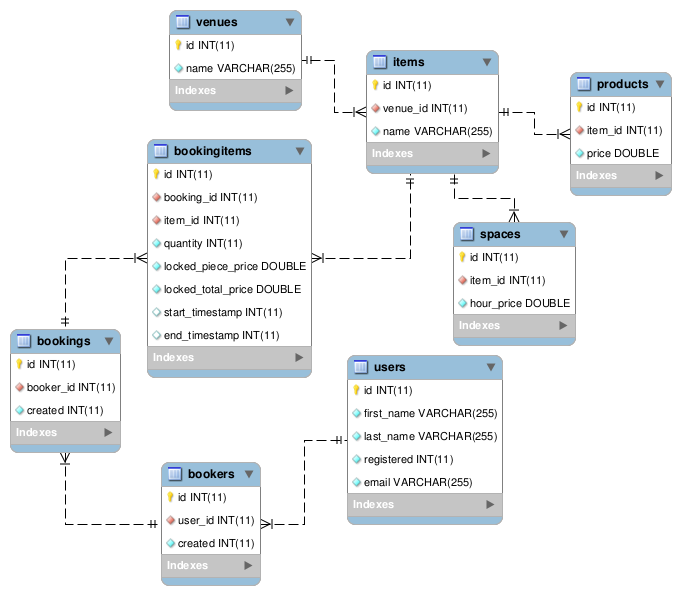

```sql
SELECT
  first_booking_month_formatted AS year_month,
  count(booker_id)              AS total_bookers,
  sum(bookings_count)           AS total_bookings,
  sum(total_price)              AS total_price
FROM (SELECT
        by_month.booker_id,
        first_booking_month_formatted,
        count(DISTINCT booking_id) AS bookings_count,
        sum(locked_total_price)    AS total_price
      FROM
        (SELECT
           booker_id,
           min(i.end_timestamp)                                           AS first_booking_timestamp,
           strftime('%Y-%m', datetime(min(i.end_timestamp), 'unixepoch')) AS first_booking_month_formatted
         FROM bookings b
           INNER JOIN bookingitems i ON (i.booking_id = b.id)
           INNER JOIN items ON items.id = i.item_id
           INNER JOIN spaces ON items.id = spaces.item_id
         GROUP BY b.booker_id) AS by_month JOIN bookings b ON (b.booker_id = by_month.booker_id)
        INNER JOIN bookingitems i ON (i.booking_id = b.id)
      WHERE datetime(by_month.first_booking_timestamp, 'unixepoch') < date('now', ':period month')
      GROUP BY by_month.booker_id, first_booking_month_formatted) AS grouped
GROUP BY first_booking_month_formatted
ORDER BY first_booking_month_formatted
```